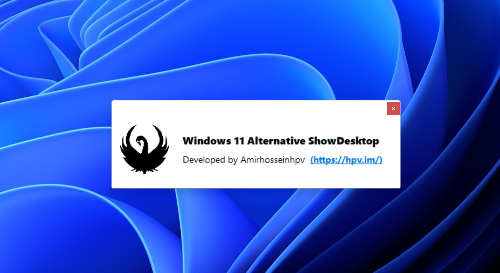

# **Windows 11 Alternative ShowDesktop**

>***Ever wondering why Dragging to Show Desktop Button in Windows 11 does not work ?***
Honestly, I don't know either. But I've made a very simple tool that whenever your mouse buttons are pressed down, and you are in show desktop button area (bottom left corner of screen), the app will automatically show desktop so you can release your mouse click and drop into desktop (wait about 0.7sec to see desktop). Whenever app is running you'll see its icon in taskbar tray area. You can easily copy app to startup folder ( Winkey+R, shell:startup ) and run it on Windows startup. Source is written in AutoIt3 and is also available for free. Enjoy!

*Developed by Amirhosseinhpv ( https://amirhosseinhpv.com/ )*
